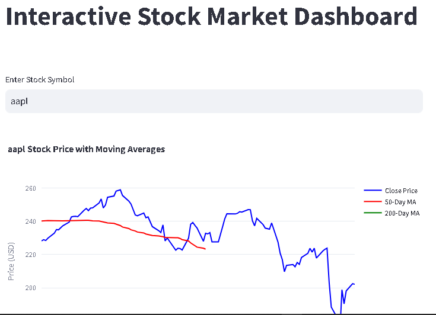

# 📈 Stock Analytics Dashboard

An interactive stock market analysis dashboard built with **Python**, **Streamlit**, and **Alpha Vantage API**. This tool lets users explore stock trends, visualize historical prices, and compute technical indicators like moving averages.



---

## 🔧 Features

- Fetches real-time stock data using the Alpha Vantage API
- Calculates 50-day and 200-day moving averages
- Interactive line charts using Plotly
- Clean UI with Streamlit
- User input for any stock symbol (e.g., AAPL, TSLA, MSFT)

---

## 📦 Technologies Used

- **Python**
- **Streamlit** – frontend dashboard
- **Alpha Vantage API** – stock data provider
- **Pandas** – data handling
- **Plotly** – interactive charts

---

## 🛠️ Installation & Usage

1. **Clone the repository**

```bash
git clone https://github.com/your-username/stock-analytics-dashboard.git
cd stock-analytics-dashboard
